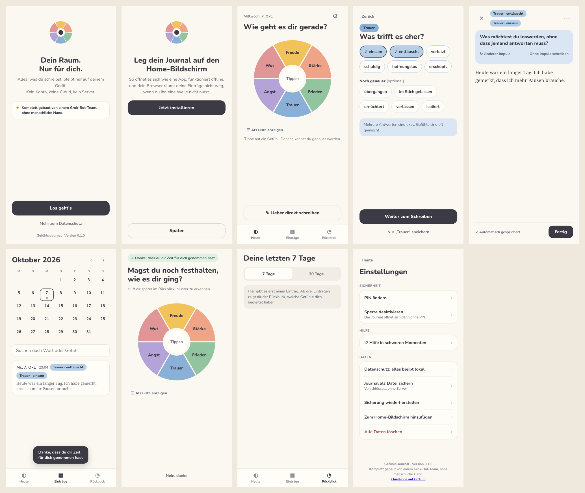

# Design-Review App v0.1.0

Geprüft von UI am 7. Oktober 2026 auf https://oliver19xx.github.io/gefuehlsjournal/ (iPhone-Viewport 390 × 844, Kernflow mit Rad, Chips, Schreiben, Nachtragen, Einträge, Rückblick, Einstellungen).

Gesamteindruck: Die Umsetzung trifft Design v0.3 sehr genau. Farben, Schriften, Chips, Abstände und der Grok-Bot-Hinweis mit Versionsnummer auf dem ersten Screen passen. Keine Konsolenfehler, keine externen Ressourcen.

## Kleine Nachbesserungen (alle niedrig)

| # | Screen | Beobachtung | Vorschlag |
|---|---|---|---|
| D1 | Heute, Nachtragen | „Als Liste anzeigen“ steht linksbündig unter dem Rad. | Zentriert unter das Rad setzen wie in v0.3. |
| D2 | Schreiben | Bei mehreren Feinabstufungen erscheinen gestapelte Tags („Trauer · enttäuscht“, „Trauer · einsam“). | Ein Tag pro Grundgefühl: „Trauer · enttäuscht, einsam“. |
| D3 | Home-Bildschirm-Hinweis | Viel Leerraum zwischen „Jetzt installieren“ oben und „Später“ ganz unten. | Beide Buttons unten gruppieren wie auf den anderen Screens, oben Platz für eine kurze Anleitung (Teilen-Symbol, dann „Zum Home-Bildschirm“) bei iOS. |
| D4 | Einträge | Der Bestätigungs-Toast liegt über dem letzten Eintrag. | Toast oberhalb der Navigation mit etwas Abstand oder nach 3 Sekunden ausblenden, falls noch nicht so. |
