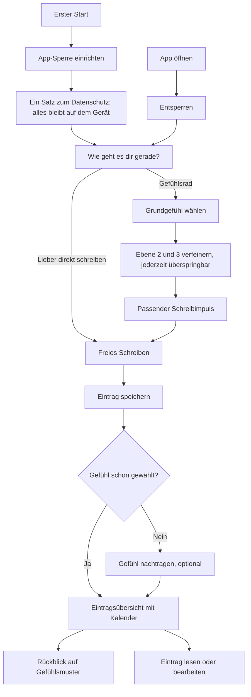

# Flows und Wireframes

Verantwortlich: UX. Stand: v0.1 (7. Oktober 2026). Low-Fidelity in Graustufen; Farben, Typografie und finale Gestaltung kommen aus `design/`.

## Kern-Flow

## Wireframes v0.1

| Nr. | Screen | Zweck und Verhalten |
|---|---|---|
| 1 | Erster Start | Onboarding in unter einer Minute: App-Sperre (Face ID oder Code), ein Satz zum Datenschutz, dann direkt zum ersten Eintrag. Sperre kann übersprungen werden. |
| 2 | Gefühl wählen | Startscreen „Heute". Einstieg über das Gefühlsrad (Ebene 1). „Lieber direkt schreiben" ist immer sichtbar. |
| 3 | Genauer werden | Ebene 2 und 3 als Auswahl-Chips, Mehrfachauswahl möglich, jederzeit überspringbar. |
| 4 | Schreiben mit Impuls | Schreibimpuls passend zum gewählten Gefühl, austauschbar. Kein Wortzähler, automatisches Speichern. |
| 5 | Gefühl nachtragen | Erscheint nur nach direktem Schreiben ohne Gefühl. Optional, ein Tipp zum Überspringen. |
| 6 | Einträge und Kalender | Punkte im Kalender zeigen das Gefühl des Tages. Tippen öffnet den Eintrag. |
| 7 | Rückblick | Woche und Monat, Verteilung der Gefühle, wertungsfreie Hinweise auf Muster. Keine Streaks. |
| 8 | Schwere Momente | Telefonseelsorge (0800 111 0 111, 0800 111 0 222). Erreichbar über das Menü und als sanfter Hinweis, nie automatisch ausgelöst. |

Hinweise: Die Gefühlsnamen am Rad sind Platzhalter, die endgültige Liste kommt aus dem Design. Zahlen im Rückblick sind Beispieldaten. Navigation unten: Heute, Einträge, Rückblick.

## Quellen

`v0.1/quellen/gen.py` erzeugt `index.html`; der PNG-Export entsteht per Headless-Chrome-Screenshot.
