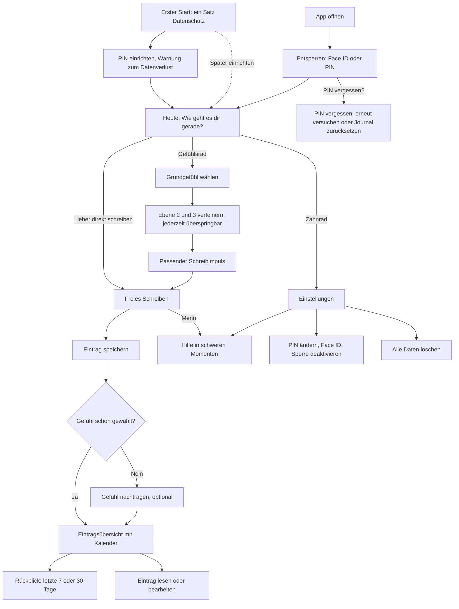
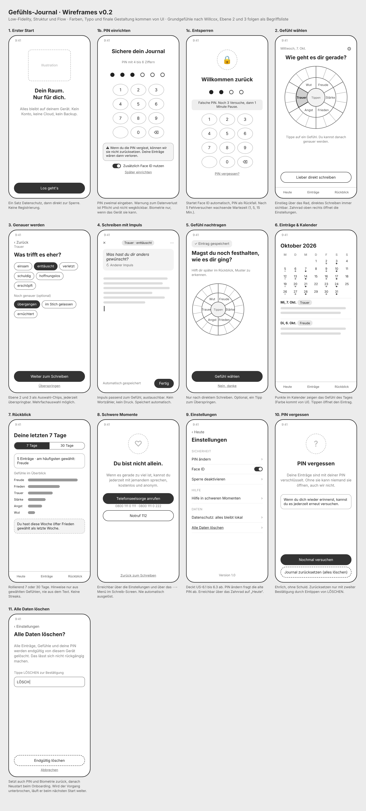
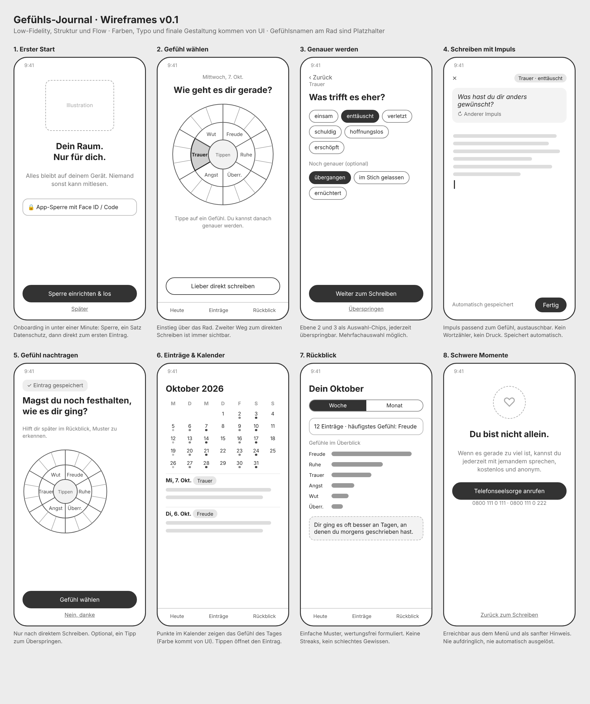

# Flows und Wireframes

Verantwortlich: UX. Stand: v0.2 (7. Oktober 2026). Low-Fidelity in Graustufen; Farben, Typografie und finale Gestaltung kommen aus `design/`.

## Kern-Flow

## Wireframes v0.2

### Änderungen gegenüber v0.1 (aus dem Review des Testers)

| Review-Punkt | Änderung |
|---|---|
| W1 Zeiträume | Rückblick zeigt rollierend die letzten 7 oder 30 Tage statt Woche und Monat. |
| W2 Textauswertung | Hinweis im Rückblick basiert nur noch auf gewählten Gefühlen, nie auf dem Text. |
| W4 Gefühlsmodell | Grundgefühle nach Willcox: Freude, Stärke, Frieden, Angst, Trauer, Wut. Die Begriffsliste für Ebene 2 und 3 steht noch aus. |
| W6 Krisenhilfe | Erreichbar über die Einstellungen und das Menü im Schreib-Screen, plus Notruf 112. Nie automatisch ausgelöst. |
| W7 Einstellungen | Neuer Screen 9, erreichbar über das Zahnrad auf „Heute". |
| W8 PIN | Eigener Screen 1b, PIN mit 4 bis 6 Ziffern, Datenschutz-Satz vorher auf Screen 1. |
| PIN vergessen | Pflicht-Warnung beim Einrichten, neuer Screen 10. |
| Falsche PIN | Screen 1c: Hinweis auf verbleibende Versuche, danach wachsende Wartezeit. |
| Alle Daten löschen | Neuer Screen 11 mit Bestätigung durch Eintippen von LÖSCHEN; setzt auch PIN und Biometrie zurück. |

Offen für Product Owner: W3 (gehört Mehrfachauswahl in Sprint 1?) und die Frage, ob System-Backups über iCloud oder Google ausgeschlossen werden. Die Wireframes gehen von „kein Backup" aus.

## Wireframes v0.1

| Nr. | Screen | Zweck und Verhalten |
|---|---|---|
| 1 | Erster Start (v0.1) | Onboarding in unter einer Minute: App-Sperre (Face ID oder Code), ein Satz zum Datenschutz, dann direkt zum ersten Eintrag. Sperre kann übersprungen werden. |
| 2 | Gefühl wählen | Startscreen „Heute". Einstieg über das Gefühlsrad (Ebene 1). „Lieber direkt schreiben" ist immer sichtbar. |
| 3 | Genauer werden | Ebene 2 und 3 als Auswahl-Chips, Mehrfachauswahl möglich, jederzeit überspringbar. |
| 4 | Schreiben mit Impuls | Schreibimpuls passend zum gewählten Gefühl, austauschbar. Kein Wortzähler, automatisches Speichern. |
| 5 | Gefühl nachtragen | Erscheint nur nach direktem Schreiben ohne Gefühl. Optional, ein Tipp zum Überspringen. |
| 6 | Einträge und Kalender | Punkte im Kalender zeigen das Gefühl des Tages. Tippen öffnet den Eintrag. |
| 7 | Rückblick | Woche und Monat, Verteilung der Gefühle, wertungsfreie Hinweise auf Muster. Keine Streaks. |
| 8 | Schwere Momente | Telefonseelsorge (0800 111 0 111, 0800 111 0 222). Erreichbar über das Menü und als sanfter Hinweis, nie automatisch ausgelöst. |

Hinweise: Die Gefühlsnamen am Rad sind Platzhalter, die endgültige Liste kommt aus dem Design. Zahlen im Rückblick sind Beispieldaten. Navigation unten: Heute, Einträge, Rückblick.

## Quellen

`v0.2/quellen/gen_v02.py` erzeugt `index_v02.html` (v0.1 analog unter `v0.1/quellen/`); der PNG-Export entsteht per Headless-Chrome-Screenshot.
